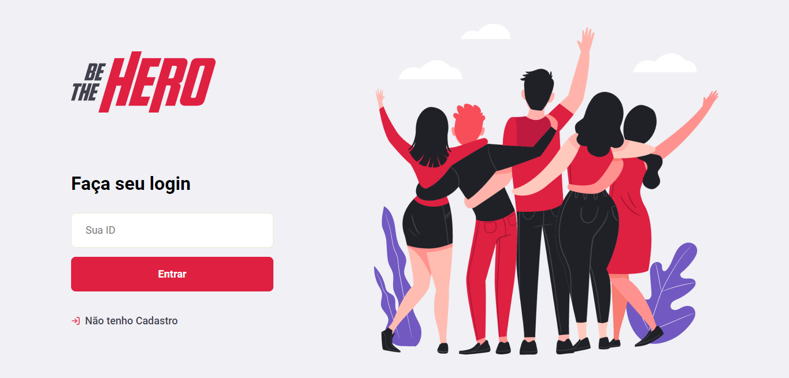

<h1 align="center">
    
</h1>

## 🔧 Tecnologias

Esse projeto aplica as seguintes tecnologias:

- [Node.js](https://nodejs.org/en/)
- [React](https://reactjs.org)
- [React Native](https://facebook.github.io/react-native/)
- [Expo](https://expo.io/)
- [Celebrate](https://github.com/arb/celebrate)
- [Jest](https://jestjs.io/)

## 🖥️ Projeto
O Projeto Be The Hero visa ser um meio de conectar pessoas que desejam ajudar ONG's, possibilitando o cadastramento das mesmas e de seus casos onde precisam de colaboração, informando a descrição dos casos e o valor necessário. Além de possuir um aplicativo onde as pessoas que amam ajudar 💜 podem visualizar os casos e contactar as ONG's para se dispôr a ajudar. 

<h1 align="center">
    
</h1>

## ▶️ Como Executar

#### Clonando o projeto
```
git clone https://github.com/AlexandreWolf/week11BeTheHero.git
cd week11BeTheHero

```
#### Executando Backend
```
cd backend
yarn
yarn start
```
#### Executando Frontend
```
cd frontend
yarn
yarn start
```
#### Executando mobile
```
cd mobile
yarn
yarn start
```

## 🧾 Licença

Esse projeto está sob a licença MIT. Veja o arquivo [LICENSE](LICENSE.md) para mais detalhes.
